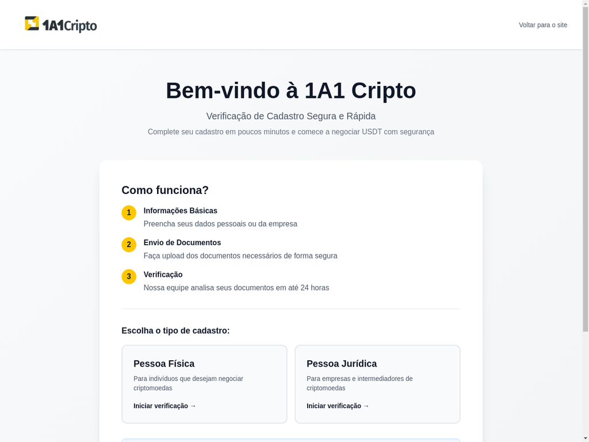
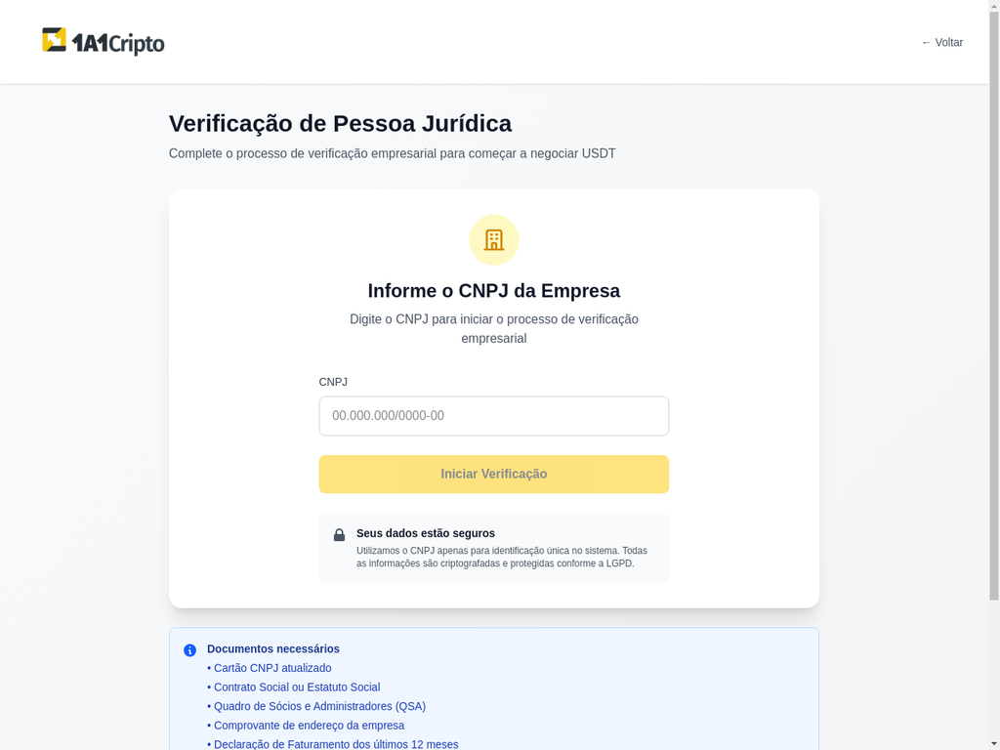

# 📸 Fluxo Visual Completo - Sistema de Onboarding

## 🏠 Página Inicial


**O que o cliente vê:**
- Logo da 1A1 Cripto
- Título: "Bem-vindo à 1A1 Cripto"
- Subtítulo: "Verificação de Cadastro Segura e Rápida"
- Explicação do processo em 3 passos:
  1. Informações Básicas
  2. Envio de Documentos
  3. Verificação (até 24 horas)
- Dois cards para escolher:
  - **Pessoa Física** (amarelo)
  - **Pessoa Jurídica** (roxo)

---

## 🏢 Página de Pessoa Jurídica


**O que o cliente vê:**
- Título: "Verificação de Pessoa Jurídica"
- Campo para digitar CNPJ
- Botão "Iniciar Verificação"
- Aviso de segurança LGPD
- **Lista completa de documentos necessários:**
  - ✅ Cartão CNPJ atualizado
  - ✅ Contrato Social ou Estatuto Social
  - ✅ Quadro de Sócios e Administradores (QSA)
  - ✅ Comprovante de endereço da empresa
  - ✅ **Declaração de Faturamento dos últimos 12 meses**
  - ✅ **Previsão de Faturamento (para empresas novas)**
  - ✅ **Balanço Patrimonial**
  - ✅ **DRE (Demonstração do Resultado do Exercício)**
  - ✅ **Políticas de Compliance PLD/FT**
  - ✅ **Últimos 3 Recibos da IN1888**
  - ✅ Documentos pessoais dos representantes legais
  - ✅ Procuração (se aplicável)

---

## 📋 Fluxo Completo Passo a Passo

### **1. Cliente acessa o link**
`https://onboarding.1a1cripto.com`

### **2. Cliente escolhe tipo de cadastro**
- Clica em "Pessoa Jurídica"

### **3. Cliente digita CNPJ**
- Exemplo: `19.131.243/0001-97`
- Sistema valida formato

### **4. Cliente clica "Iniciar Verificação"**
- Sistema cria applicant no Sumsub
- Sistema consulta **BrasilAPI** automaticamente
- Sistema salva razão social no banco

### **5. Widget Sumsub abre**
- Cliente faz upload dos documentos
- Cliente tira selfie ao vivo (liveness)
- Cliente preenche dados adicionais

### **6. Cliente finaliza**
- Redirecionado para página de sucesso
- Aguarda análise da equipe

### **7. Sumsub aprova** ✅
- Webhook recebe evento `applicantReviewed`
- Sistema gera **magic link de contrato**
- **Notificação WhatsApp enviada para VOCÊ:**

```
✅ ONBOARDING APROVADO

Tipo: Pessoa Jurídica
Nome: Empresa XYZ Ltda
CNPJ: 19.131.243/0001-97
Email: contato@empresa.com
ID: cnpj_19131243000197
Data: 31/10/2025, 14:52:45

Status: ✅ Aprovado

━━━━━━━━━━━━━━━━━━━━━━━━━━━━
📄 LINK PARA CONTRATO
━━━━━━━━━━━━━━━━━━━━━━━━━━━━

👉 Link para assinatura:
https://onboarding.1a1cripto.com/contract?token=a1b2c3d4-e5f6-7890-abcd-ef1234567890

⏰ Válido por: 7 dias

━━━━━━━━━━━━━━━━━━━━━━━━━━━━
💬 AÇÃO NECESSÁRIA
━━━━━━━━━━━━━━━━━━━━━━━━━━━━

Copie e envie o link acima para o cliente assinar o contrato.
```

### **8. Você copia e envia o link para o cliente**
- Via WhatsApp, email, etc.

### **9. Cliente acessa o link de contrato**
`https://onboarding.1a1cripto.com/contract?token=UUID`

**O que o cliente vê:**
- ✅ Dados preenchidos automaticamente:
  - Tipo: Pessoa Jurídica
  - CNPJ: 19.131.243/0001-97
  - Razão Social: Empresa XYZ Ltda (da BrasilAPI)
  - Email: contato@empresa.com
- ✅ Texto completo do contrato (16 cláusulas)
- ✅ Checkbox: "Li e concordo com os termos"
- ✅ Botão: "Assinar Contrato Eletronicamente"

### **10. Cliente lê e assina o contrato**
- Marca checkbox
- Clica em "Assinar"
- Sistema captura:
  - ✅ Timestamp (data/hora exata)
  - ✅ IP do cliente
  - ✅ User-Agent (navegador/SO)
- **Sistema gera PDF do contrato** com todos os dados
- **Sistema salva PDF no Supabase Storage**

### **11. Cliente é redirecionado automaticamente**
`https://onboarding.1a1cripto.com/wallet?token=UUID`

**Notificação WhatsApp enviada para VOCÊ:**

```
📝 CONTRATO ASSINADO

Tipo: Pessoa Jurídica
Nome: Empresa XYZ Ltda
CNPJ: 19.131.243/0001-97
Email: contato@empresa.com
ID: cnpj_19131243000197
Data: 31/10/2025, 14:55:30

━━━━━━━━━━━━━━━━━━━━━━━━━━━━
💼 PRÓXIMA ETAPA: WALLET
━━━━━━━━━━━━━━━━━━━━━━━━━━━━

👉 Link para cadastro de wallet:
https://onboarding.1a1cripto.com/wallet?token=x1y2z3a4-b5c6-7890-defg-hi1234567890

⏰ Válido por: 30 dias

━━━━━━━━━━━━━━━━━━━━━━━━━━━━
💬 AÇÃO NECESSÁRIA
━━━━━━━━━━━━━━━━━━━━━━━━━━━━

Copie e envie o link acima para o cliente cadastrar a wallet USDT.
```

### **12. Cliente acessa página de wallet**

**O que o cliente vê:**
- ✅ Dados do contratante (tipo, nome, CNPJ)
- ✅ Campo para endereço TRC-20
- ✅ Validação de formato (começa com "T", 34 caracteres)
- ✅ Termo de Cadastro de Wallet
- ✅ Checkbox: "Li e concordo"
- ✅ Botão: "Cadastrar Wallet"

### **13. Cliente cadastra wallet**
- Digita endereço TRC-20: `T1a2b3c4d5e6f7g8h9i0j1k2l3m4n5o6p7`
- Marca checkbox
- Clica em "Cadastrar"

**Notificação WhatsApp enviada para VOCÊ:**

```
💼 WALLET CADASTRADA

Tipo: Pessoa Jurídica
Nome: Empresa XYZ Ltda
CNPJ: 19.131.243/0001-97
Email: contato@empresa.com
ID: cnpj_19131243000197
Data: 31/10/2025, 14:58:15

━━━━━━━━━━━━━━━━━━━━━━━━━━━━
💼 WALLET CADASTRADA
━━━━━━━━━━━━━━━━━━━━━━━━━━━━

Endereço TRC-20:
`T1a2b3c4d5e6f7g8h9i0j1k2l3m4n5o6p7`

━━━━━━━━━━━━━━━━━━━━━━━━━━━━
🔍 AÇÃO NECESSÁRIA
━━━━━━━━━━━━━━━━━━━━━━━━━━━━

1. Realizar KYT via Chainalysis
2. Verificar score de risco
3. Aprovar ou rejeitar wallet
```

### **14. Cliente vê página de sucesso**

**O que o cliente vê:**
- ✅ Ícone de sucesso
- ✅ Mensagem: "Wallet Cadastrada!"
- ✅ Próximos passos:
  - Análise KYT via Chainalysis
  - Verificação de compliance
  - Aprovação final
- ✅ Tempo estimado: 1-2 dias úteis

### **15. Você faz KYT manual**
- Acessa Chainalysis
- Faz screening do endereço TRC-20
- Verifica score de risco
- Aprova ou rejeita

### **16. Cliente liberado para operar** 🎉

---

## 📊 Resumo do Fluxo

```
Cliente → Cadastro → Sumsub → Aprovação
   ↓
Você recebe link de contrato
   ↓
Você envia para cliente
   ↓
Cliente assina contrato
   ↓
PDF gerado e salvo automaticamente
   ↓
Cliente redirecionado para wallet
   ↓
Você recebe link de wallet
   ↓
Você envia para cliente
   ↓
Cliente cadastra wallet
   ↓
Você recebe endereço TRC-20
   ↓
Você faz KYT via Chainalysis
   ↓
Você aprova/rejeita
   ↓
Cliente liberado! 🚀
```

---

## ✅ Confirmações

### **Redirecionamento automático após assinatura?**
✅ **SIM!** Após assinar o contrato, o cliente é automaticamente redirecionado para a página de cadastro de wallet com o token já incluído na URL.

### **O que mostramos na página de contrato?**
✅ Dados do cliente (tipo, documento, nome/razão social, email)
✅ Texto completo do contrato (16 cláusulas)
✅ Checkbox de concordância
✅ Botão de assinatura eletrônica
✅ Texto de validade jurídica

### **O que mostramos na página de wallet?**
✅ Dados do contratante
✅ Campo para endereço TRC-20
✅ Validação de formato
✅ Termo de Cadastro de Wallet
✅ Checkbox de concordância
✅ Avisos de segurança

### **PDF é gerado automaticamente?**
✅ **SIM!** Quando o cliente assina, o sistema:
- Gera PDF com jsPDF
- Inclui dados do cliente
- Inclui timestamp, IP, User-Agent
- Salva no Supabase Storage (bucket `contracts`)
- Atualiza campo `contract_pdf_path` no banco

---

## 🎯 Próximas Ações Recomendadas

1. ✅ **Configurar bucket `contracts` no Supabase Storage**
   - Acessar: Supabase Dashboard → Storage
   - Criar bucket "contracts" (privado)

2. ✅ **Configurar URL de redirecionamento no Sumsub**
   - Acessar: Sumsub Cockpit → Dev space → WebSDK settings
   - Campo: Post-verification redirect URL
   - Valor: `https://onboarding.1a1cripto.com/onboarding/success`

3. ✅ **Testar fluxo completo**
   - Fazer cadastro de teste
   - Verificar notificações WhatsApp
   - Assinar contrato
   - Cadastrar wallet
   - Verificar PDF gerado

4. ✅ **Integrar Chainalysis API** (quando tiver acesso)
   - Automatizar KYT
   - Aprovar/rejeitar automaticamente baseado em score

